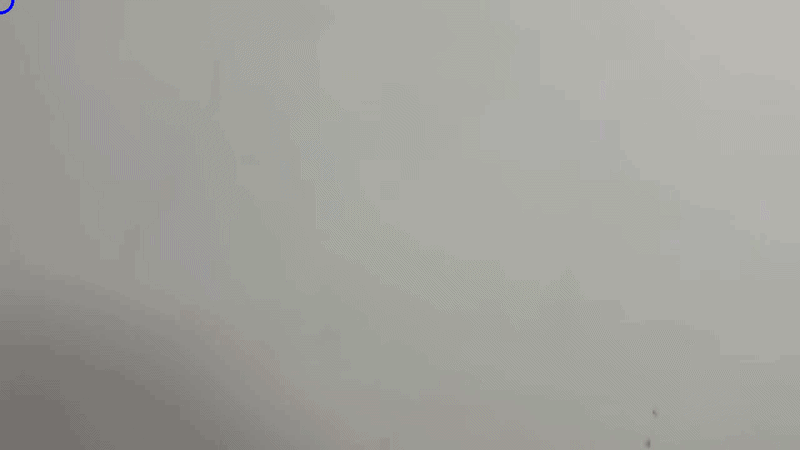
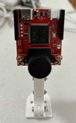
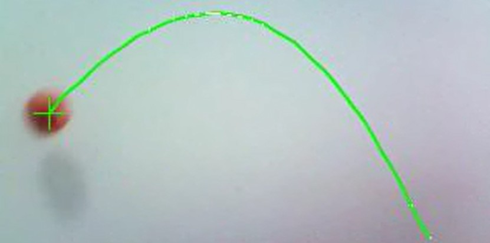
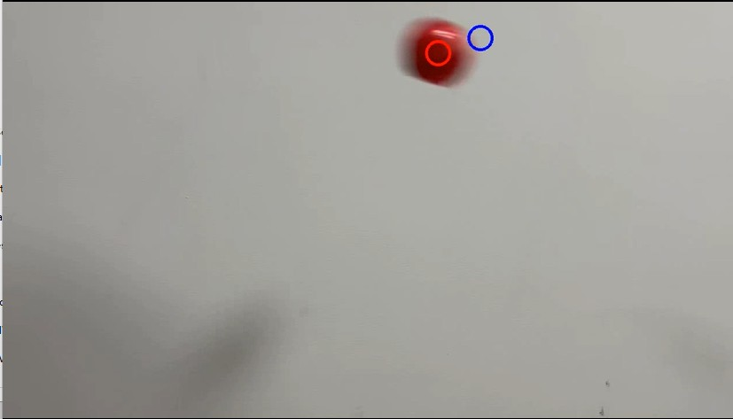
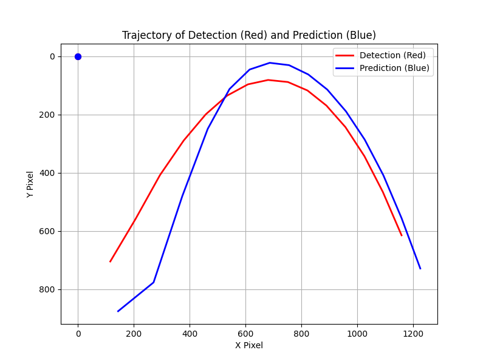

# Object Trajectory Tracking & Prediction: OpenMV vs. OpenCV

A comparative study of object trajectory tracking: Real-time embedded drawing with OpenMV4 H7 R2 and offline path prediction using OpenCV with Kalman Filter.

## 1. Project Overview
* **Real-time Tracking (OpenMV):** Low-latency trajectory drawing on an embedded microcontroller.
* **Trajectory Prediction (OpenCV):** Off-line video analysis using a Kalman Filter to predict movement paths.

## 🎥 Video Demonstration

| OpenMV Real-time Demo | OpenCV Prediction Demo |
| :---: | :---: |
|  |  |

> *Left: OpenMV Real-time Trajectory Drawing | Right: OpenCV Kalman Filter Prediction*

## 2. System Comparison

| Feature | OpenMV System | OpenCV System |
| :--- | :--- | :--- |
| **Hardware** | **OpenMV4 H7 R2** | PC / Laptop (Python) |
| **Logic** | Real-time Framebuffer drawing | Post-processing of .mp4 files |
| **Core Algorithm** | Color Thresholding (find_blobs) | **Kalman Filter** Prediction |
| **Environment** | OpenMV IDE (MicroPython) | Python 3.x (OpenCV, Matplotlib) |
| **Outputs** | Live display on camera | Processed .mp4 & Matlab-style plots |

## 3. Module Details

### 🔴 OpenMV Real-time Trajectory (`redball_realtime_trajectory.py`)

| Hardware Setup | Trajectory Result |
| :---: | :---: |
|  |  |

* **Setup:** Configured for QVGA resolution with fixed white balance for stable color recognition.
* **Drawing:** Stores up to 50 points in a buffer and connects them using `draw_line`.
* **Timeout Logic:** If the ball is lost for more than **3 seconds**, the trajectory is automatically cleared to start a new session.

### 🔵 OpenCV Prediction & Analysis (`orange_prid_tra_record.py`)

| Processed Video Frame | Matplotlib Analysis |
| :---: | :---: |
|  |  |

* **Algorithm Source:** The Kalman Filter and detection logic are based on [Pysource (9. Kalman filter, predict the trajectory of an Object)](https://pysource.com/2021/11/02/kalman-filter-predict-the-trajectory-of-an-object/).
* **Dual Trajectories:**
    * **Red Line:** Actual detected coordinates from the video.
    * **Blue Line:** Predicted path generated by the Kalman Filter algorithm.
* **Data Visualization:** Uses `matplotlib` to generate real-time comparison graphs (Y-axis inverted to match image coordinates).

## 4. How to Run

1. **Hardware Side:** Flash `redball_realtime_trajectory.py` to your OpenMV4 H7 R2 via OpenMV IDE.
2. **Software Side:** * Install dependencies: `pip install opencv-python numpy matplotlib`
    * Ensure `orange_detector.py` and `kalmanfilter.py` are in the same directory.
    * Run `orange_prid_tra_record.py` to process your input video (e.g., `ball05.mp4`).
